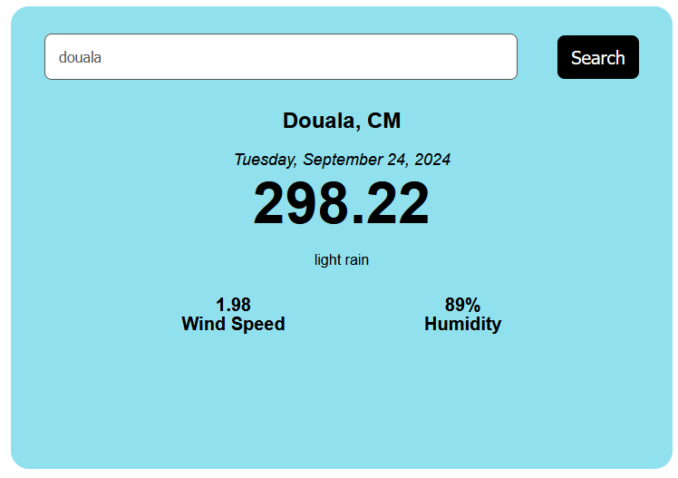

# Project 21: Weather App

## Description

This is a simple weather application built with React that allows users to search for weather information by city. The app fetches data from the OpenWeatherMap API and displays the current weather, temperature, humidity, wind speed, and a brief weather description.

## Features

- Search for weather information by city name.
- Displays current temperature, humidity, wind speed, and weather description.
- Automatically fetches weather data for a default city on initial load.
- Responsive design with loading indicators.

## Technologies Used

- React
- JavaScript
- CSS
- OpenWeatherMap API

 